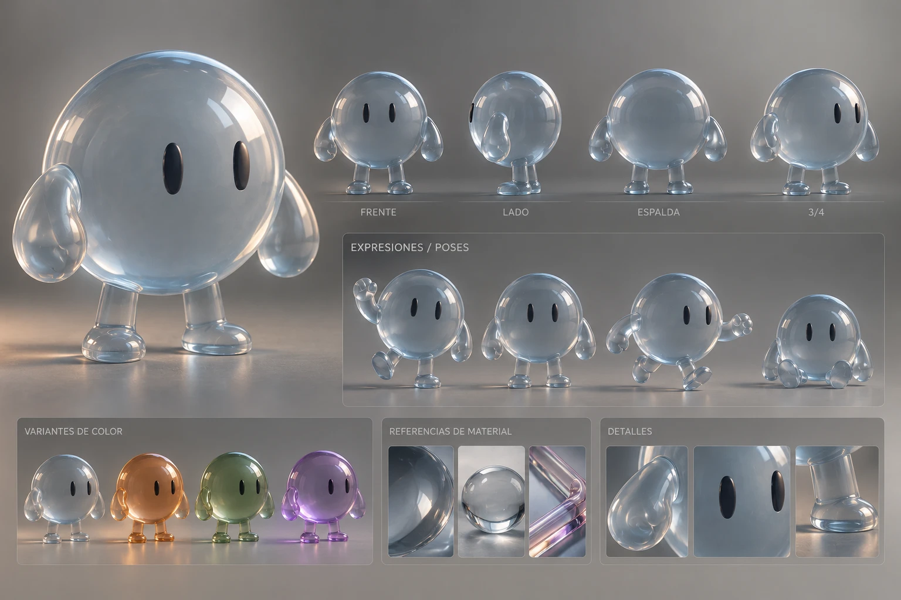

# ORBEX

Un compañero de vidrio que vive en el notch de tu MacBook. ORBEX es una esfera translúcida con dos ojos ovalados negros, brazos en forma de gota y piernitas: respira, parpadea, te mira, reacciona, te asiste con IA, vigila tus sesiones de Claude Code y se transforma en un reloj flotante.

> Estado y avance: ver [`docs/PLAN.md`](docs/PLAN.md).
> Diseño completo: ver [`docs/00-informe-completo.md`](docs/00-informe-completo.md).



---

## Instalar (en tu Mac)

Requisitos: **macOS 14 o superior** (Liquid Glass nativo en macOS 26+) y las **Xcode Command Line Tools** o Xcode (`xcode-select --install`).

1. Bajá el repo como zip (botón verde **Code → Download ZIP**) y descomprimilo.
2. Abrí la Terminal en la carpeta descomprimida y corré:

   ```bash
   ./scripts/install.sh
   ```

   Esto compila la app, arma `ORBEX.app` con su ícono, la copia a **Aplicaciones**, genera **`dist/ORBEX.dmg`** y abre ORBEX.
3. La primera vez macOS puede avisar que "no se puede verificar al desarrollador" (la app no está notarizada). Andá a **Ajustes del Sistema → Privacidad y seguridad → Abrir igualmente**. El script ya intenta quitar la cuarentena para evitarlo.
4. En el primer arranque ORBEX te pregunta si querés un **acceso directo en el Escritorio** y si querés que **inicie con la Mac**.

Otros comandos:

| Comando | Qué hace |
|---|---|
| `./scripts/build-app.sh` | Compila y arma `dist/ORBEX.app` (sin instalar) |
| `./scripts/make-dmg.sh` | Genera `dist/ORBEX.dmg` a partir de `dist/ORBEX.app` |
| `./scripts/install.sh` | Todo junto: compilar + dmg + instalar en Aplicaciones + abrir |
| `./scripts/uninstall.sh` | Borra la app, el acceso directo, los hooks y (opcional) los ajustes |
| `swift test` | Corre las pruebas de la lógica (`OrbexCore`) |

También podés abrir `Package.swift` con Xcode y darle a *Run*.

---

## Cómo se usa

- **Pasá el mouse por el notch**: ORBEX asoma. **Clic**: se abre la isla. **Esc** o clic afuera: se cierra.
- **Clic sobre ORBEX**: se achata y se molesta. **3 clics rápidos**: se marea.
- Menú de la barra (ícono de la esfera con ojos): abrir, asistente, reloj, **Probar estados** (trabajando, te necesito, festejar, dormir…), Configuración.

| Atajo | Acción |
|---|---|
| ⌃⌥O | Abrir la isla |
| ⌃⌥A | Asistente (Fase 2) |
| ⌃⌥C | Modo reloj (Fase 4) |
| ⌃⌥, | Configuración |

---

## Cómo está hecho

- **Swift + SwiftUI + AppKit**, sin dependencias de terceros.
- Paquete de Swift con tres partes:
  - `Sources/OrbexCore` — lógica pura (estados de la isla, geometría, motor de vida, temporizadores, planificador, memoria, comandos, hooks). Con pruebas.
  - `Sources/Orbex` — la app (isla del notch, personaje, reloj, asistente, configuración, sistema).
  - `Sources/orbex-hook` — ejecutable mínimo que conecta los hooks de Claude Code con la app por un socket Unix. Si ORBEX no está abierto, sale al instante: **nunca bloquea a Claude Code**.
- ORBEX está **dibujado por código**, no usa imágenes: se puede animar todo (ojos que siguen el cursor, respiración, parpadeo, poses).
- Los sonidos están **sintetizados por código** (originales, sin licencias de terceros).
- Las claves de API se guardan en el **Keychain** de macOS. Nunca en el repo.
- Sin telemetría, sin cuenta.

## Estructura

```
docs/        informe, decisiones, fases y plan con el avance
design/      hoja del personaje, referencias (Coucou, ORBIT), logo, temas
Sources/     código (OrbexCore, Orbex, orbex-hook)
Tests/       pruebas de OrbexCore
scripts/     build, dmg, install, uninstall, ícono
sounds/      notas sobre los sonidos (se generan por código)
```

## Licencia

Todos los derechos reservados. Ver [`LICENSE`](LICENSE).
